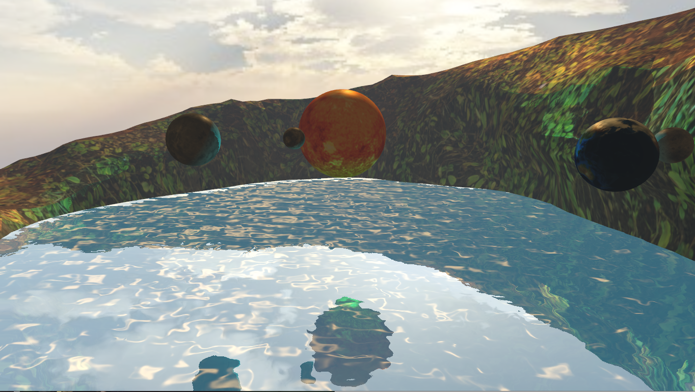

# opengl-gps
OpenGL Project - Water Shader implementation

This water shader is adapted in C++ from ThinMatrix's tutorial written in Java and implements things such as:
* Normal map
* Time-varying distortion map
* Fresnel effect

